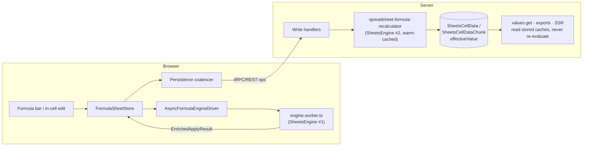
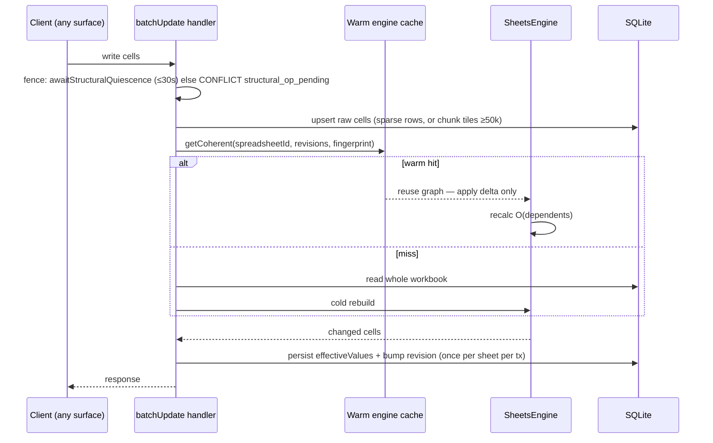

# ghee-sheets formula evaluation — verified end-to-end data flow

All anchors verified at gheeggle HEAD on 2026-09-11 by three independent read-only research passes plus manual spot-checks. Line numbers drift; re-verify before acting on any load-bearing claim.

## Contents

- [Big picture: one engine, three hosts](#big-picture-one-engine-three-hosts)
- [Inside the engine: formula string → value](#inside-the-engine-formula-string--value)
- [Server write path: request → persisted effective values](#server-write-path-request--persisted-effective-values)
- [Frontend: typing =SUM(A1:A10)](#frontend-typing-suma1a10)
- [Test map](#test-map)

## Big picture: one engine, three hosts

`SheetsEngine` (`packages/sheets-engine/src/facade.ts:108`) composes `DependencyGraph`, `Evaluator`, `FunctionRegistry`, `NamedFunctionRegistry`, `TransactionManager` (`facade.ts:116-136`). It is embedded in:

1. **Server recalculator** — `packages/sheets-product/lib/formula/spreadsheet-formula-recalculator.ts` is the only server-side construction site (`new SheetsEngine` at `:2220`). Materializes `effectiveValue` for persistence, API reads, exports.
2. **Browser web worker** — `lib/formula/worker/engine.worker.ts` runs one engine off the main thread per editor tab; requests are handled synchronously in order, correlated by id.
3. **Synchronous in-process** — headless/export surfaces and most vitest tests (`use-sheet-core-adapter.ts:171` passes `useFormulaWorker: false`; the interactive editor defaults to `true` at `lib/sheet-core/react/use-sheet-core.ts:171`).

The two live copies never talk to each other; convergence rests on identical code + the per-sheet `revision` counter + the Mode A/B persistence protocol.

## Inside the engine: formula string → value

Pipeline for `=SUM(A1:A10)`:

- **Tokenize.** `tokenize()` (`src/formula/tokenizer/lexer.ts:13`) — Chevrotain lexer, NFC-normalizes input, locale-keyed lexer cache. A comma-decimal locale genuinely changes tokenization (`core/locale.ts` drives parse AND unparse).
- **Parse.** `parseFormula()` (`src/formula/parser/visitor.ts:1001`) builds a CST, a visitor converts to a typed immutable AST, with an LRU parse cache (`parser/cache.ts:5`). No standalone syntax validator exists — parse errors become `#NAME?`/`#ERROR!` at eval.
- **AST.** `Ast` union (`src/formula/ast/nodes.ts:200-222`): literals, references (incl. open-ended `B2:B`), operators, `FunctionCall`, `NamedExpression`, `StructuredReference` (tables `Sales[Amount]`), array literals, spill operator `A1#`.
- **Wire dependencies.** `extractDependencies(ast)` (`src/formula/dependencies/index.ts:55`) statically collects every reference — both arms of `IF`, so the graph over-approximates rather than misses. `wireFormulaEdges` (`runtime/mutations/cell-ops.ts:519`) creates edges; ranges get shared `RangeVertex`s via `RangeMappingImpl`.
- **Recalculate.** `Evaluator.recalculate(dirtySet)` (`runtime/eval/evaluator.ts:299`):
  1. Expand dirty set: transitive dependents (BFS) + all volatile vertices (`NOW`/`TODAY`/`RAND`).
  2. Topological sort of the dirty subgraph (Kahn, `runtime/graph/topsort.ts:29`), with member→range edges so aggregates run after the cells they read.
  3. Bump global epoch; mark cycle groups `#CYCLE!`.
  4. Per vertex: staleness check → interpret → equality short-circuit (unchanged value stops propagation) → collect `CellChange`.
- **Dispatch.** Tree-walking interpreter (`runtime/eval/interpreter.ts:261`). `evaluateFunctionCall` (`:1663`): AST special forms (LAMBDA, LET, MAP/REDUCE/BYROW…) → case-insensitive `FunctionRegistry` → workbook named functions → `#NAME?`. Lazy argument thunks; errors propagate left-to-right.
- **Spills.** Matrix results promote to `ArrayVertex`; `_updateSpillMembers` (`evaluator.ts:1015`) materializes members, detects collisions (`#SPILL!` at anchor), caps size at `MAX_ARRAY_RESULT_CELLS` (`#CALC!`).
- **Values/errors.** `CellValue` union (`src/core/cell.ts:3-42`); numbers carry a `NumberKind` tag (date/time/currency) driving suggested formats. Typed error classes (`CycleError`, `SpillError`, `WireError` for worker-boundary rehydration).
- **Determinism.** `evalContext` carries `{evaluationTimestamp, rngSeed (pinned 0), locale}` for replay determinism.

**Doc-drift finding:** cycles always resolve to `#CYCLE!`. Iterative-calculation settings (`maxIterations`, `convergenceThreshold`) exist as Prisma model (`packages/database/prisma/schema.prisma:4014`), State-API handler, and settings dialog — nothing feeds them into evaluation. The `#CYCLE!` message references "File > Settings" (`core/errors.ts:360`); TEST-AXES §4 calls it "a supported mode". Both overstate.

## Server write path: request → persisted effective values

All three write surfaces converge — tRPC, REST (`POST /v4/spreadsheets/{id}/values:batchUpdate`), MCP (bridge forwards tool calls as HTTP to the same REST routes: `app/api/mcp/route.ts:18`, `lib/mcp-bridge.ts`) — into one procedure (`values/batchUpdate.ts:96`).

- **Fence.** `awaitStructuralQuiescence` (`operations/operation-drain.ts:213`) blocks ≤30s behind queued structural ops, then throws retryable `CONFLICT structural_op_pending` (`STRUCTURAL_OP_PENDING`, `operation-drain.ts:130`). Prevents a normal save writing at old cell positions mid-structural-op.
- **Storage tiers.** `CHUNK_STORAGE_CELL_COUNT_THRESHOLD = 50_000` populated cells (`ghee-core-backend/src/sheets-cell-storage/cell-storage-chunks.ts:72`): below, one-row-per-cell `SheetsCellData`; above, gzipped 256-row tiles (`SheetsCellDataChunk`, field `e` = effectiveValue). Distinct from `MAX_MATERIALIZED_CELLS = 100_000` (inline vs queue budget for structural ops).
- **Recalc seam.** Handlers call into `handlers/spreadsheet-formula-recalc.ts` → `recalculateSpreadsheetFormulas` (`spreadsheet-formula-recalculator.ts:1821`). `mutationRequiresFormulaRecalculation` (`:937`) gates it; structural handlers without cell deltas push the frozen `SHEET_STRUCTURE_RECALC_MUTATION` sentinel. Recalc runs inside the same transaction as the write; failure rolls the batch back.
- **Warm engine.** `WarmEngineCache` (`lib/formula/incremental-recalc/engine-cache.ts:93`): up to 8 workbook graphs in-process. `getCoherent` reuses only if (a) every per-sheet `revision` matches exactly AND (b) a structural fingerprint (named ranges, sheet titles/order, tables, named functions, locale — state revision does NOT cover) is byte-equal. Any doubt → cold rebuild. Per-spreadsheet FIFO lock serializes recalcs. Warm hit = O(dependents) via `loadIncremental` + `getDependents`; deltas containing dynamic refs (`OFFSET` etc.) deliberately invalidate.
- **Over-budget workbooks** (>100k materialized cells): no full engine — scoped recalc driven by the persisted formula index (states `dirty`/`ready`/`too_large` above 100k formula cells; maintained by `maintainFormulaIndexForWrites`), or recalc skipped and recorded.
- **Reads never re-evaluate.** `values.get`, exports, SSR read stored `effectiveValue`/`formattedValue` (`values/fetch-values-for-range.ts`), merging both tiers. Exports refresh first via `recalculateSpreadsheetFormulasForExport`: editors persist, read-only viewers get an in-memory overlay.
- **Drain (AOQ).** Same-sheet copy/paste and ≥100k-cell structural ops journal into `SheetsOperation`, ack immediately, apply in ≤15s chunk transactions with crash-resume. `finalizeOperation` (`operation-drain.ts:757`) runs the deferred recalc in its own idempotent 120s transaction; one atomic confirm bumps the revision exactly once. Known gap: a fully-resumed derivable op can skip the per-chunk recalc queue (`:773-778`).
- **Removal semantics.** Orphaned references produce `#REF!`-family errors; helpers `isOrphanedByDeleteError` (`spreadsheet-formula-recalculator.ts:478`), `getOrphanedByDeleteSheetId` (`:562`).

## Frontend: typing =SUM(A1:A10)

1. **Commit.** Formula bar `onFormulaCommit` (`components/formula-bar/formula-bar.tsx:119`) or in-cell editing (`app/spreadsheets/d/[docId]/edit/hooks/use-formula-editing.ts:165`) → `FormulaSheetStore.setCellValue` (`lib/formula/formula-sheet-store.ts:505`), which canonicalizes text (`:520-523`).
2. **Optimistic write.** Store synchronously records formula text with `effectiveValue: null` (`:525-556`). `AsyncFormulaEngineDriver` (`lib/formula/async-formula-engine-driver.ts`) pushes to the worker over a serialized promise chain; recomputed dependents return as `EnrichedApplyResult` → `applyEnrichedChangesImpl` (`lib/formula/formula-store-enriched-changes.ts`). Synchronous getters (`isSpillTarget`, `getSpillSource`, `getFormulaText`) answered by main-thread `SpillMetadataMirror` (`lib/formula/worker/spill-metadata-mirror.ts:24-83`), refreshed from every apply result. No-worker sync path: `writeCells`/`writeCellValue` (`formula-sheet-store.ts:898-990, 558-614`).
3. **Completeness gate.** Worker holds loaded cells only. Open-ended endpoints match `OPEN_COLUMN_RANGE_PATTERN`/`OPEN_ROW_RANGE_PATTERN` (`lib/formula/formula-eval-completeness.ts:33-37`); `createFormulaEvalCompletenessCheck` (`:255`) asks `CompactSheetRuntimeModel.hasCompleteRange` (`lib/sheet-runtime-model/compact-sheet-runtime-model.ts:853`, backed by `loadedRanges` `:69`); incomplete → effective value gated to `null` (nothing wrong persisted); a dependency loader bridges missing cells into the worker in 10k-cell chunks. Evaluation never triggers a backend fetch itself.
4. **Persistence, Mode A vs B.** `useSheetPersistence` (`lib/sheet-persistence/use-sheet-persistence.ts:203`, wired `sheet.core.tsx:1446`) coalesces `cellsChanged`. Formula cells persist the engine `effectiveValue` unless `#LOADING` or visibility-scoped (SUBTOTAL vs hidden rows) — then text only, server recomputes (`sheet-persistence-service.ts:886-932`). Ops drain via 202-accept + poll (`op-log/operation-accept-drain.ts:1-95`): **Mode A** = FE range checksum (`lib/operations/range-checksum.ts`) matches BE ack → done, zero data round-trip; **Mode B** = server-authoritative → re-fetch range; Mode-A checksum miss self-heals by demoting to Mode B (`:86-95`). Formula sent without `effectiveValue` triggers server recalc (`operations/operation-apply.ts:201`).
5. **Reconciliation.** `reconcileServerMutatedRange` (`app/spreadsheets/d/[docId]/edit/hooks/reconcile-server-mutated-range.ts:78-171`): clear range in store, `truncateLoadedRangesFromRow` on structural shifts, stream authoritative rows guarded by `structuralEpoch`, repaint from runtime model. Single-cell reconciles widen to the full row (`:55-70`).
6. **Undo/redo.** Cell edits wrap in a sheet-core history transaction reaching the app `UndoManager` via one `transactionPushed` listener; restored values bypass the persistence debounce and coalesce into one op.

**Three-ledger trap.** Independent "is this range loaded" state: tRPC React Query cache · runtime model `loadedRanges` (moved only by `truncateLoadedRangesFromRow`/structural handlers/`reconcileServerMutatedRange` — never by a tRPC invalidate) · sparse display `loadedViewportsRef`. The canvas paints from the runtime model, so a value-only mutation that invalidates only tRPC leaves stale beyond-window dependents on screen.

## Test map

| Layer | What it sees | Command |
|---|---|---|
| Engine (~173 files, `packages/sheets-engine/test/`) | Pure engine: parser, evaluator, spills, cycles, structured refs, fuzz, IEEE-754 boundaries, determinism parity | `cd packages/sheets-engine && pnpm test`; scope: `pnpm test <file>` (NOT `pnpm test -- <file>` — runs everything) |
| Product vitest | FE store+driver+in-process engine; BE op apply/drain, warm-engine coherence, revision bumps, real DB | repo root: `pnpm test:file '<path>'`; name filter from package dir: `pnpm test -- -t "name"` |
| Playwright e2e | Real browser worker + grid + server, Docker-isolated DB | `pnpm e2e sheets --grep "formula"` |
| Perf ref-probe | Recalc latency by topology (`RECALC_MODES = chain, fanout, aggregate`) | `scripts/perf/benchmark/bench/run.sh --groups recalc` |

Representative files: engine `test/integration/runtime/{cycle-detection,array-formulas,basic-evaluation}.test.ts`, `test/integration/facade/cross-sheet-cycles.test.ts`; product `warm-engine-coherence.integration.test.ts`, `c4-revision-bump.integration.test.ts`, `operations/structural-write-fencing.integration.test.ts`, `lib/formula/formula-eval-completeness-gate.test.ts`; e2e `e2e/specs/formulas/recalc-dirty-check.spec.ts`, `e2e/specs/partial-load/partial-load-open-formula.spec.ts`.

Seeding gotcha: `SEED=api` evaluates formulas; `SEED=state` writes raw rows with no effectiveValues — a state-seeded recalc test measures nothing.
